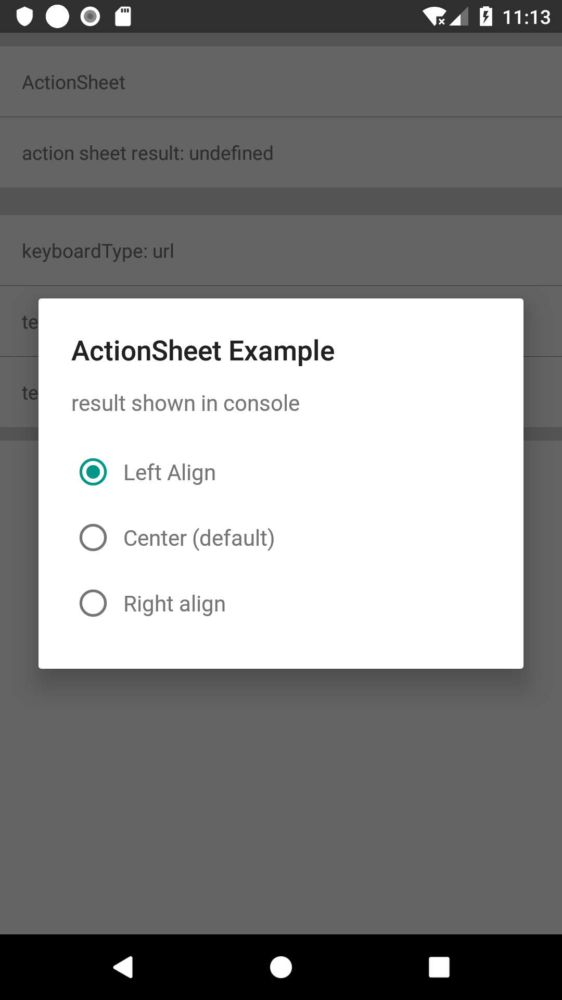
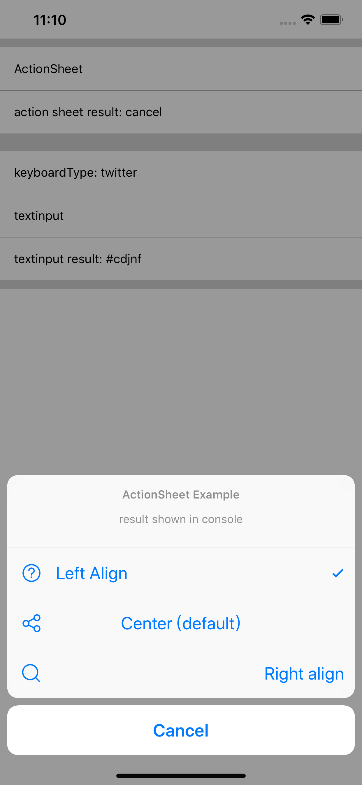
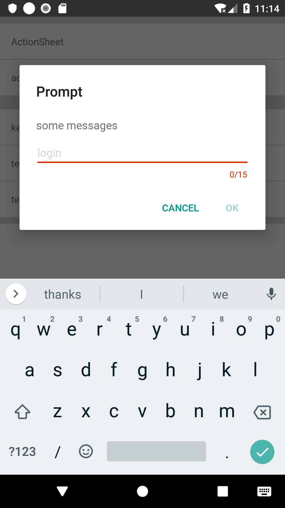
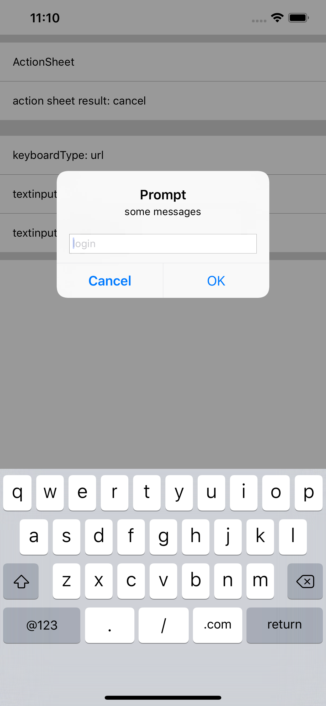

# react-native-native-dialogs

A wrapper of native-coded dialogs for simple usage.

## Install

This module is not on npm, install from github instead.

## References

1. [Apple Human Interface Guidelines](https://developer.apple.com/design/human-interface-guidelines/ios/overview/themes/)
2. [React Native Doc](https://facebook.github.io/react-native/docs/alertios)
3. [Material Design](https://material.io/design/)
4. [Material Dialogs](https://github.com/afollestad/material-dialogs/tree/03fed5b82196063a983a986128cc64ec98a321f7) by @afollestad, version 0.9.6.0
5. [react-native-dialogs](https://github.com/aakashns/react-native-dialogs) by @aakashns
6. [Hekla app](https://github.com/birkir/hekla)

## Usage

```javascript
import RNND from "react-native-native-dialogs";

RNND.showActionSheet({
  options: ["left", "right", "middle"],
  onSelect: ({ label, index }) => {
    console.log(label, index);
  }
});

RNND.prompt({
  title: "Prompt",
  detailText: "some messages",
  textInputConfig: {
    secureTextEntry: true,
    placeholder: "user name",
    maxLength: 16,
    minLength: 6,
    keyboardType: "this.state.keyboardType"
  },
  onSubmit: text => {
    console.log(text)
  }
});
```

## Screenshots

### Android simple list (item selected):



### iOS Action sheet (item selected, title align, icon)



### Android prompt (keyboard type: url, max length 15)



### iOS prompt (keyboard type URL)


